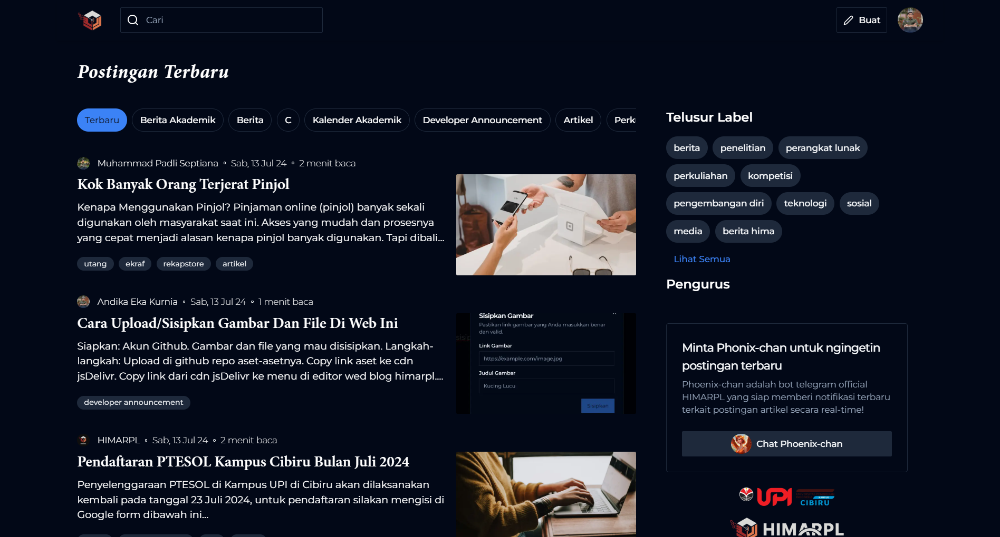

{/* ! When translating this file, please add ../ to the image path ! */}

[blog.himarpl.com](https://blog.himarpl.com) is the official blog platform for HIMARPL (Himpunan Mahasiswa Rekayasa Perangkat Lunak) members. The website is built using Next.js with the T3 Stack and features a rich text editor powered by TipTap.

## Key Features

- Rich Text Editor with WYSIWYG Interface
- User Authentication & Authorization
- Tag-based Article Organization
- Infinite Scroll Article Loading
- Search Functionality
- Responsive Design
- Dark/Light Theme Support
- Social Media Sharing
- Analytics Integration

## Libraries Used

**Core Dependencies**
- Next.js (^14.2.4)
- React (18.2.0)
- React DOM (18.2.0)
- TypeScript (^5.4.2)

**Authentication & Database**
- NextAuth (^4.24.6)
- Prisma (@prisma/client ^5.16.0)
- tRPC (@trpc/client, @trpc/next, @trpc/react-query, @trpc/server ^10.45.1)

**Editor & Content**
- TipTap (@tiptap/react ^2.2.4)
- TipTap Extensions (various @tiptap/* packages)
- HTML React Parser (^5.1.10)

**UI & Styling**
- Radix UI Components (various @radix-ui/* packages)
- Tailwind CSS (^3.4.1)
- Tailwind Typography (@tailwindcss/typography ^0.5.12)
- Framer Motion (^11.2.12)
- Embla Carousel (embla-carousel-react ^8.1.5)
- Lucide React Icons (^0.363.0)
- React Simple Icons (@icons-pack/react-simple-icons ^9.4.0)

**Form & State Management**
- React Hook Form (^7.52.0)
- React Select (^5.8.0)
- Zod (^3.23.8)

**Utilities**
- Moment (^2.30.1)
- Sharp (^0.33.3)
- PostHog Analytics (posthog-js ^1.146.2)
- Next Themes (^0.3.0)
- Use Debounce (^10.0.0)

**Development Tools**
- ESLint (^8.57.0)
- Prettier (^3.2.5)
- Jest (^29.7.0)
- Various ESLint plugins and configurations

## Support

For questions or issues:

- [GitHub Issues](https://github.com/himarplupi/blog-himarpl/issues)
- Contact Departemen Kominfo HIMARPL
- Visit [himarpl.com](https://www.himarpl.com)

## License

This project is licensed under the MIT License - see the [LICENSE](https://github.com/himarplupi/blog-himarpl/blob/main/LICENSE) file for details.
