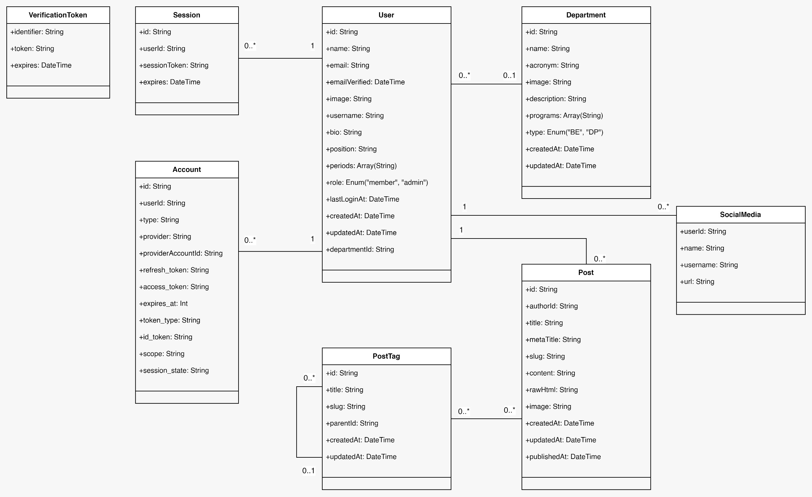

---
<<<<<<< HEAD
title: Skema Database
description: Panduan skema database untuk infrastruktur cloud HIMARPL
---

HIMARPL menggunakan dua database untuk tujuan yang berbeda:
=======
title: Skema Basis Data
description: Panduan skema basis data untuk infrastruktur cloud HIMARPL
---

HIMARPL menggunakan dua basis data untuk tujuan yang berbeda:
>>>>>>> ascendia-himarpl

1. **CockroachDB** dengan Prisma ORM - Untuk proyek inti dan infrastruktur utama
2. **PostgreSQL** (NeonDB) dengan Drizzle ORM - Untuk fungsionalitas bot

<<<<<<< HEAD
## Struktur Inti Database


=======
## Struktur Inti Basis Data


>>>>>>> ascendia-himarpl

### Class Utama

:::note[Skema Prisma]
<<<<<<< HEAD
Jika Anda ingin mengintegrasikan proyek baru Anda dengan database, Anda dapat menggunakan Skema Prisma di bawah ini.
=======
Jika Anda ingin mengintegrasikan proyek baru Anda dengan basis data, Anda dapat menggunakan Skema Prisma di bawah ini.
>>>>>>> ascendia-himarpl

<details>
<summary>Lihat Lengkap Skema Prisma</summary>

```prisma {27-37, 39-55, 57-70, 72-80, 82-102, 104-120, 122-128, 130-136}
// learn more about it in the docs: https://pris.ly/d/prisma-schema

generator client {
  provider      = "prisma-client-js"
  binaryTargets = ["native", "rhel-openssl-3.0.x"]
}

datasource db {
  provider = "cockroachdb"
  // NOTE: When using mysql or sqlserver, uncomment the @db.Text annotations in model Account below
  // Further reading:
  // https://next-auth.js.org/adapters/prisma#create-the-prisma-schema
  // https://www.prisma.io/docs/reference/api-reference/prisma-schema-reference#string
  url      = env("DATABASE_URL")
}

enum DepartmentType {
  BE
  DP
}

enum Role {
  admin
  member
}

model PostTag {
  id        String    @id @default(cuid())
  title     String    @unique
  slug      String    @unique
  createdAt DateTime  @default(now())
  updatedAt DateTime  @default(now()) @updatedAt
  parentId  String?
  parent    PostTag?  @relation("ParentChildren", fields: [parentId], references: [id])
  children  PostTag[] @relation("ParentChildren")
  posts     Post[]
}

model Post {
  id          String    @id @default(cuid())
  authorId    String
  title       String
  metaTitle   String
  slug        String
  content     String
  rawHtml     String
  image       String?
  createdAt   DateTime  @default(now())
  updatedAt   DateTime  @default(now()) @updatedAt
  publishedAt DateTime?
  author      User      @relation(fields: [authorId], references: [id])
  tags        PostTag[]

  @@unique([authorId, slug])
}

model Department {
  id          String         @id @default(cuid())
  name        String
  acronym     String
  image       String?
  description String?
  programs    String[]
  type        DepartmentType
  createdAt   DateTime       @default(now())
  updatedAt   DateTime       @default(now()) @updatedAt
  users       User[]

  @@unique([type, acronym])
}

model SocialMedia {
  userId   String
  name     String
  username String
  url      String
  user     User   @relation(fields: [userId], references: [id])

  @@unique([userId, name, username])
}

model User {
  id            String        @id @default(cuid())
  name          String?
  email         String?       @unique
  emailVerified DateTime?
  image         String?
  username      String?       @unique
  bio           String?
  position      String?
  periods       String[]
  role          Role          @default(member)
  lastLoginAt   DateTime?
  createdAt     DateTime      @default(now())
  updatedAt     DateTime      @default(now()) @updatedAt
  departmentId  String?
  department    Department?   @relation(fields: [departmentId], references: [id])
  posts         Post[]
  socialMedia   SocialMedia[]
  accounts      Account[]
  sessions      Session[]
}

model Account {
  id                String  @id @default(cuid())
  userId            String
  type              String
  provider          String
  providerAccountId String
  refresh_token     String? // @db.Text
  access_token      String? // @db.Text
  expires_at        Int?
  token_type        String?
  scope             String?
  id_token          String? // @db.Text
  session_state     String?
  user              User    @relation(fields: [userId], references: [id], onDelete: Cascade)

  @@unique([provider, providerAccountId])
}

model Session {
  id           String   @id @default(cuid())
  sessionToken String   @unique
  userId       String
  expires      DateTime
  user         User     @relation(fields: [userId], references: [id], onDelete: Cascade)
}

model VerificationToken {
  identifier String
  token      String   @unique
  expires    DateTime

  @@unique([identifier, token])
}
```

</details>

:::

#### 1. Manajemen Pengguna

- **Pengguna**

  - Informasi inti profil pengguna (nama, email, bio, posisi)
  - Dapat menjadi anggota satu departemen
<<<<<<< HEAD
  - Memiliki role-based akses (admin/anggota)
  - Melacak periode keterlibatan dan aktivitas login

- **Otentikasi**
  - **Akun**: Menangani koneksi OAuth (misalnya, login Google)
=======
  - Memiliki _role-based_ akses (admin/anggota)
  - Melacak periode keterlibatan dan aktivitas _login_

- **Otentikasi**
  - **Akun**: Menangani koneksi OAuth (misalnya, _login_ Google)
>>>>>>> ascendia-himarpl
  - **Sesi**: Mengelola sesi pengguna aktif
  - **Token Verifikasi**: Untuk verifikasi email

#### 2. Manajemen Konten

- **Postingan**

  - Artikel blog dan entri konten
<<<<<<< HEAD
  - Berisi metadata (judul, slug, gambar)
=======
  - Berisi metadata (judul, _slug_, gambar)
>>>>>>> ascendia-himarpl
  - Melacak status dan tanggal publikasi
  - Setiap postingan memiliki satu penulis (Pengguna)

- **Tag Postingan**
  - Kategorisasi konten hierarkis
<<<<<<< HEAD
  - Dapat memiliki hubungan parent-child
=======
  - Dapat memiliki hubungan _parent-child_
>>>>>>> ascendia-himarpl
  - Digunakan untuk mengatur postingan berdasarkan topik

#### 3. Struktur Organisasi

- **Departemen**

  - Dua jenis utama: BE (Badan Eksekutif) dan DP (Dewan Perwakilan)
  - Berisi informasi departemen (nama, akronim, deskripsi)
  - Melacak program terkait
  - Pengguna dapat ditugaskan ke departemen

- **Media Sosial**
  - Menghubungkan pengguna dengan profil media sosial mereka
  - Menyimpan nama platform, nama pengguna, dan URL

### Key Relationship

1. **Pengguna & Konten**

- Setiap postingan harus memiliki satu penulis
- Pengguna dapat membuat beberapa postingan
- Pengguna dapat memiliki beberapa profil media sosial

2. **Organisasi Konten**

<<<<<<< HEAD
- Postingan dapat memiliki beberapa tag
- Tag dapat memiliki hubungan parent-child
- Postingan memiliki slug unik per penulis
=======
- Postingan dapat memiliki beberapa _tag_
- _Tag_ dapat memiliki hubungan _parent-child_
- Postingan memiliki _slug_ unik per penulis
>>>>>>> ascendia-himarpl

3. **Organisasi**

- Pengguna dapat menjadi anggota satu departemen
- Departemen dapat memiliki beberapa pengguna
- Setiap pengguna memiliki peran spesifik (admin/anggota)

### Prinsip Desain Skema Prisma

<<<<<<< HEAD
- Type-safe dengan enum yang ditentukan
- Foreign-key Constraints yang tepat
=======
- _Type-safe_ dengan _enum_ yang ditentukan
- _Foreign-key Constraints_ yang tepat
>>>>>>> ascendia-himarpl
- Dapat dikembangkan untuk ekspansi di masa depan
- Hubungan hierarkis yang jelas

### Aturan Skema Prisma

- Gunakan PascalCase untuk semua model
- Gunakan camelCase untuk semua atribut

<<<<<<< HEAD
## Struktur Database Bot
=======
## Struktur Basis Data Bot
>>>>>>> ascendia-himarpl

Bot menggunakan PostgreSQL (NeonDB) dengan Drizzle ORM untuk mengelola notifikasi dan interaksi pengguna.

### Kelas Utama

:::note[Skema Drizzle]
<<<<<<< HEAD
Jika Anda ingin mengintegrasikan proyek baru Anda dengan database, Anda dapat menggunakan Skema Drizzle di bawah ini.
=======
Jika Anda ingin mengintegrasikan proyek baru Anda dengan basis data, Anda dapat menggunakan Skema Drizzle di bawah ini.
>>>>>>> ascendia-himarpl

<details>
<summary>Lihat Skema Drizzle Lengkap</summary>

```typescript {13-31}
import { sql } from "drizzle-orm";
import {
  bigserial,
  index,
  pgTableCreator,
  text,
  timestamp,
  varchar,
} from "drizzle-orm/pg-core";

export const createTable = pgTableCreator((name) => `bot-himarpl_${name}`);

export const notifications = createTable(
  "notification",
  {
    chatId: bigserial("chat_id", { mode: "number" }).primaryKey(),
    firstName: varchar("first_name", { length: 256 }),
    lastName: varchar("last_name", { length: 256 }),
    username: varchar("username", { length: 256 }),
    createdAt: timestamp("created_at", { withTimezone: true })
      .default(sql`CURRENT_TIMESTAMP`)
      .notNull(),
    notifying: text("notifying")
      .array()
      .notNull()
      .default(sql`ARRAY[]::text[]`),
  },
  (notifications) => ({
    chatIdIndex: index("chat_id_idx").on(notifications.chatId),
  })
);
```

</details>

:::

**Tabel Utama: notifications**

- **Tujuan**: Melacak notifikasi obrolan Telegram dan preferensi pengguna
- **Prefix Tabel**: `bot-himarpl_` (menggunakan pola skema multi-proyek)

**Kolom Kunci:**

<<<<<<< HEAD
- `chatId`: Pengidentifikasi unik untuk Telegram Chat (primary key)
- `firstName`: Nama depan pengguna dari Telegram
- `lastName`: Nama belakang pengguna dari Telegram
- `username`: Nama pengguna Telegram
- `createdAt`: Timestamp pembuatan obrolan
- `notifying`: Array dari topik notifikasi yang diikuti pengguna

**Detail Teknis:**

- Menggunakan type spesifik PostgreSQL (bigserial, varchar, timestamp)
- Termasuk pengindeksan pada chatId untuk pencarian lebih cepat
- Menerapkan timestamp yang beradaptasi dengan zona waktu
- Menggunakan type array untuk preferensi notifikasi

### Prinsip Desain Skema Drizzle

- Menggunakan prefix tabel untuk isolasi multi-proyek
- Menerapkan type PostgreSQL yang tepat
=======
- `chatId`: Pengidentifikasi unik untuk Telegram Chat (_primary key_)
- `firstName`: Nama depan pengguna dari Telegram
- `lastName`: Nama belakang pengguna dari Telegram
- `username`: Nama pengguna Telegram
- `createdAt`: _Timestamp_ pembuatan obrolan
- `notifying`: _Array_ dari topik notifikasi yang diikuti pengguna

**Detail Teknis:**

- Menggunakan _type_ spesifik PostgreSQL (bigserial, varchar, timestamp)
- Termasuk pengindeksan pada chatId untuk pencarian lebih cepat
- Menerapkan _timestamp_ yang beradaptasi dengan zona waktu
- Menggunakan _type array_ untuk preferensi notifikasi

### Prinsip Desain Skema Drizzle

- Menggunakan _prefix_ tabel untuk isolasi multi-proyek
- Menerapkan _type_ PostgreSQL yang tepat
>>>>>>> ascendia-himarpl
- Termasuk optimasi kinerja melalui pengindeksan
- Mengikuti studi kasus terbaik dari Drizzle ORM

### Aturan Skema Drizzle

- Gunakan camelCase untuk semua model dalam skema
- Gunakan camelCase untuk semua atribut dalam model
- Gunakan snake_case untuk semua nama tabel dalam basis data
- Gunakan snake_case untuk semua nama atribut dalam basis data
