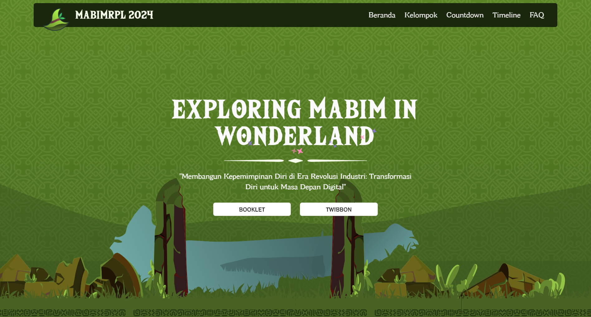

import { Tabs, TabItem } from "@astrojs/starlight/components";
import { Steps } from "@astrojs/starlight/components";
import { Code } from "@astrojs/starlight/components";

{/* ! When translating this file, please add ../ to the image path ! */}


[mabim.himarpl.com](https://mabim.himarpl.com) is the first one and only website by HIMARPL for providing information about Masa Bimbinagan RPL (Student Orientation Program) at UPI. The website is built using NextJS.

## Key Features

- Interactive Hero Section with Animated Elements
- Dynamic Group/Mentor Information System
- Event Timeline & Countdown
- FAQ Section
- Sponsor & Media Partner Showcase
- Responsive Navigation
- Smooth Scrolling & Animations
- Analytics Integration

## Core Dependencies

**Framework & Runtime**

- NextJS
- Next Themes
- PostHog
- React
- React DOM

**UI Components & Styling**
- Radix UI Components (Various @radix-ui/* packages)
- Tailwind CSS with Custom Configuration
- Framer Motion for Animations
- Shadcn UI Components
- Custom Medieval-themed Components

**Design & Animation**

- Embla Carousel Autoplay
- Embla Carousel React
- Framer Motion
- Lenis

**Asset Optimization**

- Sharp

**State Management & Utilities**
- PostHog for Analytics
- Class Variance Authority & clsx for Dynamic Styling
- Zod for Type Validation


## Project Structure

- `/src/components/common` - Core components
- `/src/components/ui` - Reusable UI components
- `/src/components/ornament` - Decorative elements
- `/src/assets` - Static assets and images
- `/src/styles` - Global styles and Tailwind configuration

## Setup Local Development


This guide will walk you through setting up a local development environment for the Mabim HIMARPL website.

### Prerequisites

Before installing the application, ensure you have:

1. [Node.js](https://nodejs.org/en) and [npm](https://www.npmjs.com/) installed
2. [Git](https://git-scm.com/) installed


### Setup Steps

<Steps>

1. Fork and clone the repository:

   <Tabs>
     <TabItem label="HTTPS">
       <Code
         code={`git clone https://github.com/himarplupi/mabim-himarpl.git`}
         lang="bash"
         title="HTTPS"
       />
     </TabItem>
     <TabItem label="SSH">
       <Code
         code={`git clone git@github.com:himarplupi/mabim-himarpl.git`}
         lang="bash"
         title="SSH"
       />
     </TabItem>
     <TabItem label="GitHub CLI">
       <Code
         code={`gh repo clone himarplupi/mabim-himarpl`}
         lang="bash"
         title="GitHub CLI"
       />
     </TabItem>
   </Tabs>

2. Navigate to project directory:

   ```bash
   cd mabim-himarpl
   ```

3. Set up remote upstream:

   <Tabs>
     <TabItem label="HTTPS">
       <Code
         code={`git remote add upstream https://github.com/himarplupi/mabim-himarpl.git`}
         lang="bash"
         title="HTTPS"
       />
     </TabItem>
     <TabItem label="SSH">
       <Code
         code={`git remote add upstream git@github.com:himarplupi/mabim-himarpl.git`}
         lang="bash"
         title="SSH"
       />
     </TabItem>
     <TabItem label="GitHub CLI">
       <Code
         code={`gh repo sync himarplu pi/mabim-himarpl`}
         lang="bash"
         title="GitHub CLI"
       />
     </TabItem>
   </Tabs>

4. Install dependencies and start development server:

   ```bash
   npm ci              # Install dependencies
   npm run dev         # Start development server
   ```

   The application should now be running at `http://localhost:3000`.

5. Create a new branch for your changes:

   ```bash
   git checkout -b my-feature-branch
   ```


6. After you are satisfied with your changes, add and commit them to your branch, then push your branch to your fork.

   ```bash
   git add .
   git commit # Please follow the commit guidelines below   
   git push -u origin my-feature-branch
   ```

   :::note[IMPORTANT]
    Before committing and opening a Pull Request, please read [Commit Guidelines](/getting-started/05-contribution-guide/#commit-guidelines) and [Pull Request Policy](/getting-started/05-contribution-guide/#pull-request-policy) below.
   :::

7. Create Pull Request.
   :::note[NOTE]
    We request PR authors to avoid rebasing/updating their PRs with the `main` branch unnecessarily.
   :::
</Steps>

### Available Scripts

- `npm run dev` - Starts development server with hot reload
- `npm run build` - Creates production build
- `npm run start` - Starts production server
- `npm run lint` - Runs linting checks

## Future Migration

Read the [future planning on domain management](../../getting-started/04-staff-guide/#future-planning) for more information about this `mabim-himarpl` website. After the migration, this website will be archived and the `mabim.himarpl.com` domain will be used for the new Mabim website.

## Support

For questions or issues:

- [GitHub Issues](https://github.com/himarplupi/mabim-himarpl/issues)
- Contact Departemen Kominfo HIMARPL
- Visit [himarpl.com](https://www.himarpl.com)

## License

This project is licensed under the MIT License - see the [LICENSE](https://github.com/himarplupi/mabim-himarpl/blob/main/LICENSE) file for details.

