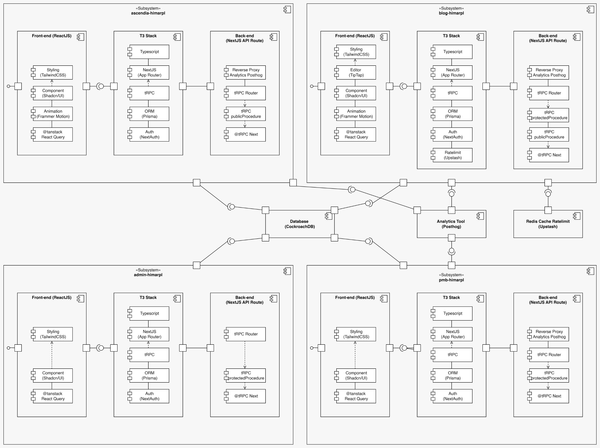
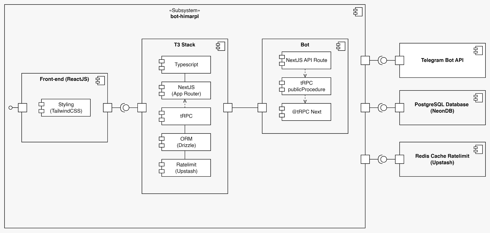

HIMARPL leverages modern cloud infrastructure to build reliable, scalable, and maintainable applications.

## Core Projects

{/* ! When translating this file, please add ../ to the image path ! */}

Our main projects follow a consistent architecture pattern:

- [Ascendia](https://github.com/himarplupi/ascendia-himarpl) - Main organization website
- [Admin Portal](https://github.com/himarplupi/admin-himarpl) - Internal admin dashboard
- [Blog Platform](https://github.com/himarplupi/blog-himarpl) - Medium-style blogging
- [PMB](https://github.com/himarplupi/pmb-himarpl) - Website information for student admission

### Three-Layer Architecture

Each project implements a three-layer architecture:

#### 1. Frontend Layer ([React](https://react.dev/))

Modern UI built with:

- 🎨 [TailwindCSS](https://tailwindcss.com/) - Utility-first styling
- 🧩 [Shadcn/UI](https://ui.shadcn.com/docs) - Reusable components
- ✨ [Motion](https://motion.dev) - Smooth animations
- 🔄 [Tanstack Query](https://tanstack.com/query) - Data fetching

#### 2. Middle Layer ([T3 Stack](https://create.t3.gg/))

Type-safe backend integration using:

- [TypeScript](https://www.typescriptlang.org/) - Type safety
- [Next.js](https://nextjs.org/) - React framework
- [tRPC](https://trpc.io/) - End-to-end typesafe APIs
- [Prisma](https://www.prisma.io/) - Database ORM
- [NextAuth](https://next-auth.js.org/) - Authentication

#### 3. Backend Layer (Next.js API Routes)

Server-side logic with:

- Analytics proxy ([PostHog integration](https://posthog.com/docs/advanced/proxy/nextjs))
- [tRPC Router](https://trpc.io/docs/server/routers) - API endpoints
- [tRPC Procedures](https://trpc.io/docs/server/procedures) - Business logic
- [@tRPC Next](https://trpc.io/docs/nextjs) - Next.js integration

### Shared Infrastructure

Core services used across all projects:

#### Database ([CockroachDB](https://www.cockroachlabs.com/))

- Distributed SQL database
- Handles cross-project data

#### Analytics ([PostHog](https://posthog.com/))

- User behavior tracking
- Performance monitoring
- Centralized analytics

#### Rate Limiting ([Upstash](https://upstash.com/))

- Redis-based rate limiting
- API rate limiting

## Event-Specific Projects

{/* ! When translating this file, please add ../ to the image path ! */}

We maintain lightweight projects for events and temporary needs:

- `lomba-himarpl` - Competition websites
- `mabim-himarpl` - Student orientation sites

These use a simplified frontend-only stack:

- Next.js + React
- TailwindCSS styling
- Shadcn/UI components
- Motion animations

## Bot Platform (Phoenix-chan)

{/* ! When translating this file, please add ../ to the image path ! */}

Our Telegram bot uses a specialized architecture:

### Components

1. **Frontend Dashboard**

   - On development, [contribute here](https://github.com/himarplupi/bot-himarpl)

2. **T3 Stack Core**

   - TypeScript
   - Next.js routing
   - Drizzle ORM
   - Upstash rate limiting

3. **Bot Service**
   - Webhook handlers
   - Command procedures
   - Telegram API integration

### External Services

- [Telegram Bot API](https://core.telegram.org/bots/api)
- [NeonDB](https://neon.tech/) (PostgreSQL)
- [Upstash](https://upstash.com/) Redis

## Deployment

We use [Vercel](https://vercel.com/) for deployment with:

- 🚀 Automated production deployments
- 🔍 Preview deployments for PRs
- ⚡️ Edge Functions support
