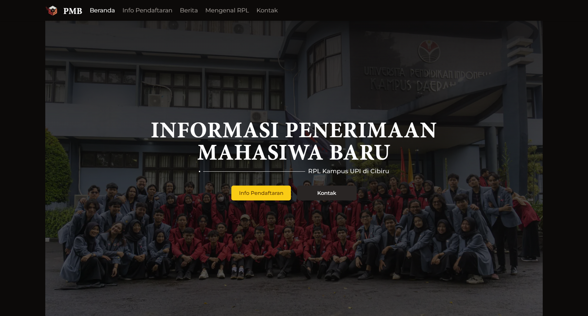

{/* ! When translating this file, please add ../ to the image path ! */}

[pmb.himarpl.com](https://pmb.himarpl.com) is the official website by HIMARPL (Himpunan Mahasiswa Rekayasa Perangkat Lunak) for providing information about new student admissions at UPI's Software Engineering program. The website is built using Next.js and follows the T3 Stack architecture.

## Key Features

- Dynamic Information Pages for Different Admission Paths (SNBP, SNBT, SM-UPI)
- Latest News Integration with Blog Platform
- Contact Information System
- Program Information Pages
- Responsive Design
- SEO Optimization
- Analytics Integration

## Core Dependencies

**Framework & Runtime**
- Next.js (^14.2.4)
- React (18.2.0)
- TypeScript (^5.4.2)

**Data Management & API**
- tRPC (@trpc/client, @trpc/next, @trpc/react-query, @trpc/server)
- Prisma (@prisma/client ^5.16.0)
- Zod (^3.22.4)

**UI Components & Styling**
- Radix UI (Various @radix-ui/* components)
- Tailwind CSS (^3.4.1)
- Tailwind Typography (@tailwindcss/typography)
- Framer Motion (^11.2.12)
- Lucide React (^0.363.0)
- React Simple Icons (@icons-pack/react-simple-icons)

**Utilities & Enhancement**
- Moment (^2.30.1) - Date formatting
- Sharp (^0.33.3) - Image optimization
- PostHog (posthog-js) - Analytics
- HTML React Parser (^5.1.9) - Content parsing
- Next Themes (^0.3.0) - Theme management

## Support

For questions or issues:

- [GitHub Issues](https://github.com/himarplupi/pmb-himarpl/issues)
- Contact Departemen Kominfo HIMARPL
- Visit [himarpl.com](https://www.himarpl.com)

## License

This project is licensed under the MIT License - see the [LICENSE](https://github.com/himarplupi/pmb-himarpl/blob/main/LICENSE) file for details.